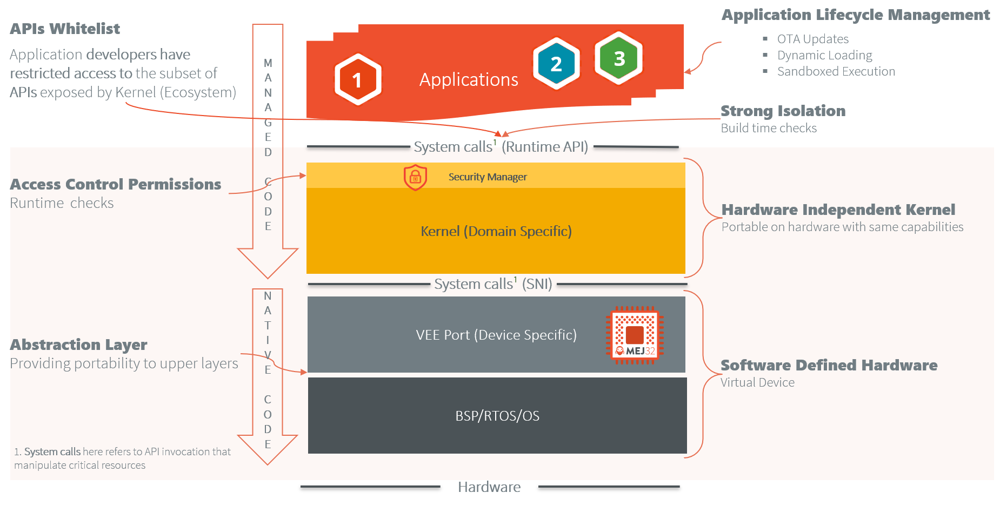

Kernel GREEN
============

Welcome to Kernel **GREEN**, a lightweight MicroEJ Kernel project designed to provide a turnkey solution with essential
services for embedded development. It enables developers to quickly build and deploy sandboxed applications, using the
full potential
of [MicroEJ’s multi-sandboxing technology](https://docs.microej.com/en/latest/VEEPortingGuide/multiSandbox.html).

This project serves as both an adaptable starting point for creating embedded systems and a learning platform for
understanding multi-sandboxing capabilities. By focusing on modularity and simplicity, Kernel GREEN empowers developers
to build secure, efficient, and responsive applications suitable for a range of devices and embedded environments.



**Key Features:**

- **Modular Architecture**: Configures only essential components to optimize memory.
- **App Sandboxing**: Creates secure, isolated environments for app protection.
- **Inter-App Communication**: Enables secure app interactions
  via [Shared Interfaces](https://docs.microej.com/en/latest/ApplicationDeveloperGuide/sandboxedAppSharedInterface.html).
- **API Protection**: Secures critical APIs with SOAR (compile-time) and a Security Manager (runtime) for permissions.
- **Health Monitoring**: Monitor critical system resources such as CPU, RAM.
- **Portability**: Compatible with all MCU and MPU platforms supported by MicroEJ, tested on *NXP i.MX RT1170* and
  *STM32F7508-DK*.
- **Extensive Libraries**: Supports a broad range of libraries and protocols like HTTP/S, MQTT, CoAP, and LWM2M.
- **MicroEJ GUI**: Offers a lightweight, powerful GUI stack for UI development.

## Requirements

This Kernel must be built against a VEE Port.
The VEE Port serves as the portability layer for MicroEJ VEE, enabling it to operate on the target device. It acts as an
abstraction layer between the Kernel and the Board Support Package (BSP).

This kernel can be built using any VEE Port that provides the following Foundation Libraries:

| Foundation Library | Version |
|--------------------|---------|
| EDC                | 1.3     |
| BON                | 1.4     |
| Multi-Sandbox (KF) | 1.7     |
| NET                | 1.1     |
| SSL                | 2.2     |
| SECURITY           | 1.7     |
| MicroUI            | 3.1     |
| Drawing            | 1.0     |
| FS                 | 2.1     |

### Compatibility Matrix for Reference VEE Ports

The kernel has been tested with the following reference VEE Ports:

**[NXP i.MX RT1170](https://github.com/nxp-mcuxpresso/nxp-vee-imxrt1170-evk)**

| Kernel version | VEE Port version |
|----------------|------------------|
| 1.3.0          | 2.1.1            |
| 1.4.0          | 2.1.1            |
| 2.0.0          | 2.2.0            |
| 2.1.*          | 3.0.0            |
| 2.2.0          | 3.0.0            |

**[STM32F7508-DK](https://github.com/MicroEJ/VEEPort-STMicroelectronics-STM32F7508-DK)**

| Kernel version | VEE Port version |
|----------------|------------------|
| 1.3.0          | 2.0.0            |
| 1.4.0          | 2.0.0            |
| 2.0.0          | 2.3.0            |
| 2.1.*          | 2.3.0            |
| 2.2.0          | 2.3.0            |

For further information about VEE Ports, please refer to their respective README.

## Pre-built Binaries

Pre-built binaries for this kernel are available for *NXP i.MX RT1170* and *STM32F7508-DK*, ideal for developers
exploring application development on this kernel.

To get started, follow the
[Getting Started With Pre-built Kernel Guide](https://docs.microej.com/en/latest/KernelDeveloperGuide/gettingStarted.html).

If you wish to extend the source code or compile for a different target
board, [see the next section](#how-to-build-the-project-using-gradle).

## How to Build the Project Using Gradle

This project is built with Java and uses the Gradle build system for easy compilation and deployment.

Follow these steps to build and run the kernel on MicroEJ Simulator, or flash it on a development board:

1. [Accept MICROEJ SDK End-User License Agreement (EULA)](#accept-microej-sdk-end-user-license-agreement-eula)
2. [Install Java JDK](#install-java)
3. [Configure Gradle Module Repositories](#configure-gradle-module-repositories)
4. [Request a MicroEJ Evaluation License](#request-microej-evaluation-license)
5. [Install Toolchain and Flash Tools for your target Development Board](#install-toolchain-and-flash-tools-for-development-board)
6. [Compile the Project](#compile-the-project)
7. [Run](#run)

### Accept MICROEJ SDK End-User License Agreement (EULA)

The [MICROEJ SDK EULA](https://repository.microej.com/licenses/sdk/LAW-0011-LCS-MicroEJ_SDK-EULA-v3.1C.txt) must be
accepted before compiling this project. You can accept the EULA by:

- specifying the `-Daccept-microej-sdk-eula-v3-1c=YES` command line option,
- or setting the system property `systemProp.accept-microej-sdk-eula-v3-1c=YES` in a `gradle.properties` file,
- or setting the `ACCEPT_MICROEJ_SDK_EULA_V3_1C=YES` environment variable.

### Install Java

The SDK requires JDK 11 or a higher LTS version to be installed, with either:

- The `JAVA_HOME` environment variable set to the JDK path,
- Or the JDK's `java` executable accessible in the `PATH`.

It can be downloaded from https://adoptium.net/

### Configure Gradle Module Repositories

- Create the directory `<user.home>/.gradle/init.d` if it doesn’t already exist.
- Download and place the following file in the newly created folder.
  [microej.init.gradle.kts](https://docs.microej.com/en/latest/_downloads/e172eabd5b1f579b3e5636e65eb0fcaa/microej.init.gradle.kts)
  This file configures the necessary MicroEJ repositories to access required dependencies.

### Request MicroEJ Evaluation License

A MicroEJ Evaluation license is required to compile this project.

To request an evaluation license, first obtain your device UID by running the following command:

```bash
gradlew buildExecutable
```

This command will display your device UID, which you'll need to request an evaluation license by following the steps in
the [MicroEJ SDK User Guide](https://docs.microej.com/en/latest/SDK6UserGuide/licenses.html#request-your-activation-key).

Once you have your UID, use it to complete the license request process as outlined in the guide.

**Example Console Log Output:**

```bash
  [INFO ] Launching in Evaluation mode. Your UID is XXXXXXXXXXXXXXXX.
  [ERROR] Invalid license check (No license found).
  Java returned: -1
```

Once you receive your evaluation license zip archive, simply place it in the `~/.microej/licenses/` directory (create
the directory if it doesn’t already exist).

### Install Toolchain and Flash Tools for Development Board

Download and configure the toolchain for your target board, and install the necessary flash tools to enable program
flashing.

<details>
<summary><b>NXP i.MX RT1170</b></summary>

Download [MCUXpressoInstaller](https://github.com/nxp-mcuxpresso/vscode-for-mcux/wiki/Dependency-Installation) and use
it to install the following tools:

- **MCUXpresso SDK Developer**: This will install "Arm GNU Toolchain" with required NXP libraries and header file.
- **Link Server**: will be used to flash the board

**Make** must also be installed.

For Debian based distro use:

````bash
sudo apt install make
````

For Windows, consider installing it via [getgnuwin32](https://sourceforge.net/projects/getgnuwin32/), and add the
installation path to your system PATH environment variable.

````bash
> make -v

GNU Make 3.81
Copyright (C) 2006  Free Software Foundation, Inc.
This is free software; see the source for copying conditions.
There is NO warranty; not even for MERCHANTABILITY or FITNESS FOR A
PARTICULAR PURPOSE.

This program built for i386-pc-mingw32
````

</details>


<details>
<summary><b>STM32F7508-DK Discovery Kit</b></summary>

Install the STM toolchain & flash tools. **TO be completed.**

</details>

### Compile the Project

Run the following Gradle command to compile the project:

   ```bash
   gradlew build
   ```

This command will compile the Java project and link it with the VEE Port to produce the final flashable executable and
it's associated virtual device.

- Executable are located in `build/application/executable` directory.
- Virtual Device is located in `build/virtualDevice` directory.

### Run

The sections below outline the Gradle commands for running the kernel. Select your target environment and follow the
steps to run the kernel on either the simulator or the development board.

<details>
<summary><b>Run on Simulator</b></summary>

Execute the following command to run the kernel using the simulator. This command will run the kernel on your PC.

 ```bash
   gradlew runOnSimulator
   ```

</details>

<details>
<summary><b>Run on Dev Board</b></summary>

Execute the following Gradle command to flash the binary to your board.

 ```bash
   gradlew runOnDevice
   ```

</details>

## Kernel Configuration

The kernel provides a range of configurable services through the properties
file: [kernel.properties.list](src/main/resources/kernel.properties.list).

### Available Configurable Services:

- **Logging**: Configure logging levels to control kernel output, including enabling, disabling, or fine-tuning the
  verbosity.
- **Security Manager**: Enable or disable the security manager and customize its implementation as per your
  requirements.
- **Connectivity Manager**: Manage network interface monitoring and internet connectivity checks, including enabling,
  disabling, and configuration.
- **Network Time Protocol (NTP)**: Set up NTP servers for accurate time synchronization.
- **Health Monitoring**: Monitor CPU and RAM usage by enabling, disabling, and customizing the resource monitoring
  features.
- **Storage**: Define and configure the storage service implementation to be used by the kernel.

Refer to the `kernel.properties.list` file for detailed configuration options for each service.

## Importing the Kernel Project into an IDE

The MicroEJ SDK 6 is flexible and not tied to any specific Integrated Development Environment (IDE), allowing you the
freedom to choose from various supported IDEs. MicroEJ provides detailed documentation on using SDK 6 with the following
IDEs:

- [IntelliJ IDEA](https://www.jetbrains.com/idea/)
- [Android Studio](https://developer.android.com/studio?hl=en)
- [Eclipse](https://eclipseide.org/)

To learn how to import a Kernel project into these IDEs, please refer
to  [Import Project](https://docs.microej.com/en/latest/SDK6UserGuide/importProject.html) documentation.

## Configure the VEE Port

The VEE Port configuration is done in the [build.gradle.kts](./build.gradle.kts) file.

The VEE Port can be configured in one of the following ways:

- By declaring it as a Module Dependency. (default)
- By specifying its local source directory.

### Declaring the VEE Port as a Module Dependency

This approach allows for fetching the VEE Port sources from a MicroEJ repository. By default, the MicroEJ SDK is
configured to fetch VEE Ports from
the [Developer Repository](https://docs.microej.com/en/latest/SDKUserGuide/repository.html#developer-repository).

In order to declare the VEE Port dependency:

* Open the [build.gradle.kts](./build.gradle.kts) file.
* Set the ``defaultVeePortGroup`` variable to your VEE Port group name.
* Set the ``defaultVeePortModule`` variable to your VEE Port module name.
* Set the ``defaultVeePortVersion`` variable to your VEE Port version.

You can also override the default variables by using specifying arguments in the Gradle commands.

For instance, to ensure the VEE Port configuration, you can execute the ``loadVee`` Gradle task such as:

```bash
gradlew loadVee -Dveeport.group=yourVEEPortGroup -Dveeport.module=yourVEEPortModuleName -Dveeport.version=yourVEEPortVersion
```

If the VEE Port has been correctly configured, the output result should be:

```bash
BUILD SUCCESSFUL in 12s
1 actionable task: 1 up-to-date
```

### Specifying the VEE Port source directory

This approach allows for building the Kernel against a VEE Port which sources are fetched locally.

_Kernel GREEN_ is indeed not bound to a specific VEE Port and can be built against any other VEE Port as long as
the [VEE Port requirements](#requirements) are met.

Sources for the reference VEE Ports are [available on GitHub](#requirements).

In order to set a local VEE Port path:

* Open the [build.gradle.kts](./build.gradle.kts) file.
* Set the ``defaultLocalVEEPortPath`` variable to your local VEE Port source folder.

You can also override the default variable by using specifying arguments in the Gradle commands.

For instance, to ensure the VEE Port configuration, you can execute the ``loadVee`` Gradle task such as:

```bash
gradlew loadVee -Dlocal.veeport.path=C:\path\to\local\veeport\source
```

**NOTE:** If the variable ``defaultLocalVEEPortPath`` is not empty, the ``build.gradle.kts`` file will use the specified
local VEE Port path. Otherwise, it will use the module dependency way to fetch the VEE Port.

## Health Monitoring

The Health Monitoring Service enables periodic monitoring of RAM and CPU usage for the kernel and running applications.

It can be enabled and configured using the following system properties in
the [kernel.properties.list](src/main/resources/kernel.properties.list) file.

````properties
health.check.enabled=true
# Polling interval in milliseconds for monitoring resource consumption.
health.check.interval.ms=10000
# If true, runs Garbage Collector before collecting RAM usage for refined monitoring.
# Not recommended for production.
health.check.gc.force=false
# This value represents the mapping of CPU load to the MicroEJ execution counter per one second.
# It is generated during a calibration phase on the target device.
health.check.cpu.calibration=590000
````

### CPU Monitoring Overview

The MicroEJ VEE provides a detailed monitoring mechanism for CPU usage by tracking execution counters for each module,
including the kernel and applications.

#### Key Points:

1. **Execution Units**:

- The CPU usage is measured in execution units.
- Each execution unit corresponds to a single instruction executed by the MicroEJ VEE.

2. **Calibration for 100% Utilization**:

- Calibration determines the maximum execution counter value representing approximate 100% CPU usage.
- This process involves running dedicated calibration code that pushes the CPU to its maximum capacity.

3. **Calibration Procedure**:

- During calibration, the MicroEJ VEE must be the only active task on the board to ensure accurate results.
- The calibration process requires running specific code provided in the KF-Util library:
  - Update the `applicationEntryPoint` in [build.gradle.kts](build.gradle.kts) to
    `com.microej.kf.util.monitoring.CpuCalibration`.
  - Deploy and run the calibration code on your device.
  - Get the calibration result logged by the code and update the value of the `monitoring.check.cpu.calibration` 
property in the [kernel.properties.list](src/main/resources/kernel.properties.list).
  - You can now revert the change in the [build.gradle.kts](build.gradle.kts) and run your project as usual.

By following these steps, the system can accurately measure CPU usage and provide reliable monitoring capabilities.

## Deploy an application

Once the Kernel is built, Sandboxed Applications can then be dynamically deployed on the Kernel.

For more information about Sandboxed Applications, please refer to
the [official documentation](https://docs.microej.com/en/latest/ApplicationDeveloperGuide/sandboxedApplication.html)

To deploy an application on the Kernel, paste the following code in the ``build.gradle.kts`` file of the application.
Make sure to paste the ``import`` lines at the beginning of your ``build.gradle.kts`` file.

This code will register a new Gradle task named ``localDeploy`` in the ``microej`` group for the Sandboxed application
that can be run like any other Gradle task.

**Note:** in the bellow code, make sure to update ``boardIP``, ``boardPort`` variable to use your board IP address and port.

```kotlin
import com.microej.gradle.tasks.BuildFeatureTask
import okhttp3.MediaType.Companion.toMediaType
import okhttp3.MultipartBody
import okhttp3.OkHttpClient
import okhttp3.Request
import okhttp3.RequestBody.Companion.asRequestBody
import java.util.*

val buildFeatureTask = tasks.withType(BuildFeatureTask::class).named("buildFeature")
tasks.register("localDeploy") {
  dependsOn("buildFeature")
  group = "microej"

  // Adjust the following variables to your needs
  val boardIP = "<Board IP Address>" // board ip address
  val boardPort = 4001 // AppConnect port
  val force = true // overwrote existing app with same name
  val start = false // start app after install
  // Note: if your metadata (feature.kf) is part of '/src/main/resources', modify this path accordingly
  val featureKFFilePath = "generated/microej-app-wrapper/feature-resources/feature.kf"

  doLast {
    val applicationFOFile = buildFeatureTask.get().featureFile.get().asFile
    val properties = Properties()
    project.layout.buildDirectory.file(featureKFFilePath).get().asFile.inputStream().use(properties::load)
    val appName = properties.getProperty("name") ?: error("App name not found in $featureKFFilePath")
    val appVersion = properties.getProperty("version") ?: error("App version not found in $featureKFFilePath")

    println("Deploying app $appName $appVersion to board at $boardIP:$boardPort")
    val url = "http://$boardIP:$boardPort/api/app/install?force=$force&start=$start&name=$appName"
    val client = OkHttpClient()
    val multipartBody = MultipartBody.Builder().setType(MultipartBody.FORM) //
      .addFormDataPart(
        "binary",
        applicationFOFile.name,
        applicationFOFile.asRequestBody("application/octet-stream".toMediaType())
      )//
      .build()
    val request = Request.Builder().url(url).post(multipartBody).build()
    client.newCall(request).execute().use { response ->
      if (response.isSuccessful) {
        println("Deployment Successful! Response Code: ${response.code}")
        println("App info: ${response.body?.string()}")
      } else {
        System.err.println("Deployment Failed. Response Code: ${response.code}")
        System.err.println("Cause: ${response.body?.string()}")
      }
    }
  }
}

buildscript {
  repositories {
    maven {
      name = "mavenCentral"
      url = uri("https://repo.maven.apache.org/maven2/")
    }
  }
  dependencies {
    classpath("com.squareup.okhttp3:okhttp:4.12.0")
  }
}
```

## Going further

By now, you should have completed the initial functional Kernel.
Before proceeding with any customization, please consult
the [Kernel Developer Guide](https://docs.microej.com/en/latest/KernelDeveloperGuide/index.html).

If you wish to understand the core Multi-Sandboxing mechanisms, you can refer to the following resources:

- The [Kernel & Features specification](https://docs.microej.com/en/latest/KernelDeveloperGuide/kf.html) which provides
  a detailed explanation of core concepts.
- The [ej.kf.Kernel class](https://repository.microej.com/javadoc/microej_5.x/apis/ej/kf/Kernel.html) which offers the
  complete Javadoc API.

The following sections deal with specific topics you may want to experiment with.

### Security management

_Note: please refer
to [this section](https://docs.microej.com/en/latest/KernelDeveloperGuide/kernelCreation.html#implement-a-security-policy)
from the [Kernel Developer Guide](https://docs.microej.com/en/latest/KernelDeveloperGuide/index.html) to get a primer on
security management._

_Kernel GREEN_ provides two ready-to-use implementations:

* (default) a logging-only policy
  using [KernelSecurityManager](https://repository.microej.com/javadoc/microej_5.x/apis/com/microej/kf/util/security/KernelSecurityManager.html)
  in order to demonstrate how the Kernel may restrict sensitive or possibly unsafe operations performed by applications.
* an actual security policy based on resource file from applications
  using [KernelSecurityPolicyManager](https://repository.microej.com/javadoc/microej_5.x/apis/com/microej/kf/util/security/KernelSecurityPolicyManager.html)
  that allows application to describe permissions they will need at runtime.

These operations cover all operations restricted by one of the
supported [Permission](https://repository.microej.com/javadoc/microej_5.x/apis/java/security/Permission.html)s which
are, in this Kernel:

* [DisplayPermission](https://repository.microej.com/javadoc/microej_5.x/apis/ej/microui/display/DisplayPermission.html)
* [EventPermission](https://repository.microej.com/javadoc/microej_5.x/apis/ej/microui/event/EventPermission.html)
* [FilePermission](https://repository.microej.com/javadoc/microej_5.x/apis/java/io/FilePermission.html)
* [FontPermission](https://repository.microej.com/javadoc/microej_5.x/apis/ej/microui/display/FontPermission.html)
* [ImagePermission](https://repository.microej.com/javadoc/microej_5.x/apis/ej/microui/display/ImagePermission.html)
* [MicroUIPermission](https://repository.microej.com/javadoc/microej_5.x/apis/ej/microui/MicroUIPermission.html)
* [NetPermission](https://repository.microej.com/javadoc/microej_5.x/apis/java/net/NetPermission.html)
* [ej.property.PropertyPermission](https://repository.microej.com/javadoc/microej_5.x/apis/ej/property/PropertyPermission.html)
* [java.util.PropertyPermission](https://repository.microej.com/javadoc/microej_5.x/apis/java/util/PropertyPermission.html)
* [RuntimePermission](https://repository.microej.com/javadoc/microej_5.x/apis/java/lang/RuntimePermission.html)
* [ServicePermission](https://repository.microej.com/javadoc/microej_5.x/apis/ej/service/ServicePermission.html)
* [SocketPermission](https://repository.microej.com/javadoc/microej_5.x/apis/java/net/SocketPermission.html)
* [SSLPermission](https://repository.microej.com/javadoc/microej_5.x/apis/javax/net/ssl/SSLPermission.html)

To switch between the two ready-to-use implementations listed above, you can edit
the [security.properties.list](src/main/resources/kernel.properties.list) file by updating the
``security.manager.mode`` property value to the following values:

* ``LOGGING`` (default): uses the logging only security management policy to show any protected access by any
  application at runtime.
* ``POLICY_FILE``: uses the resource file based system to allow each application to describe permissions it will need at
  runtime.

A more complete explanation of these implementations is available on
the [MicroEJ Developer Website](https://docs.microej.com/en/latest/KernelDeveloperGuide/applicationSecurityPolicy.html)
in the  ``Application security policy`` section.

## Troubleshooting

### The local specified VEE Port path is not correctly set

This error is caused when the path specified for a local VEE Port in the ``build.gradle.kts`` file is not pointing to a
valid VEE Port folder.

```bash
FAILURE: Build failed with an exception.

* What went wrong:
  Execution failed for task ':loadVee'.
> No 'release.properties' and 'architecture.properties' files found.
The given file Path/to/specified/VEEPort/path is not a VEE archive.
```

---
_Copyright 2021-2025 MicroEJ Corp. All rights reserved._  
_Use of this source code is governed by a BSD-style license that can be found with this software._